<div align="center">

# LSTM 比朴素贝叶斯强多少？

**基于 THUCNews 十类别 20 万条中文新闻的文本分类、词典情感分析与一次基线公平性诊断**

</div>

---

## 一句话结论

> 在 THUCNews 十类别 20 万条中文新闻标题上，Word2Vec + LSTM 取得 **88.68%** 的测试准确率（h=64，仅用 30,000 条训练子集，实测 85.7 秒）。但论文中作为对照的 Naive Bayes 基线 **29.67%** 所反映的差距，有相当一部分来自词元切分的设定而非模型本身——该基线在**未分词**的中文标题上使用 `\b\w+\b` 切词，每条文本实际只切出 **1.97 个 token**，10,000 条测试样本中有 **7,655 条**被预测为同一类别。若让基线与 LSTM 共用同一份 jieba 分词结果，NB 在同等 30,000 条训练预算下达到 **84.19%**，用全量 180,000 条训练达到 **86.58%**，两者差距相应为 **4.49 / 2.10 个百分点**。词典情感分析显示测试集正面 43.3%、中性 41.7%、负面 15.0%，但其中 **32.1%** 的样本根本不含任何情感词。

完整论文见 [`report/paper.pdf`](report/paper.pdf)（中文，正文 6 页 + 代码附录）。本仓库同时保留论文原值与诊断复算值，差异逐条列在第八节。

---

## 目录

- [一、研究问题：为什么"89% 对 30%"这个对比需要先检查](#一研究问题为什么89-对-30这个对比需要先检查)
- [二、核心发现](#二核心发现)
- [三、方法原理](#三方法原理)
- [四、实验结果](#四实验结果)
- [五、项目结构](#五项目结构)
- [六、复现指南](#六复现指南)
- [七、这个项目体现了哪些能力](#七这个项目体现了哪些能力)
- [八、局限与后续改进](#八局限与后续改进)
- [九、参考文献与引用](#九参考文献与引用)
- [十、致谢与-ai-使用声明](#十致谢与-ai-使用声明)

---

## 一、研究问题：为什么"89% 对 30%"这个对比需要先检查

THUCNews 十类别子集对分类器相当友好：测试集每类恰好 **1,000** 条，类别完全均衡；文本是新浪新闻标题，jieba 分词后平均长度仅 **8.08 个词**（中位数 8，标准差 1.85，范围 1–15）。

<table>
<tr>
<td width="50%">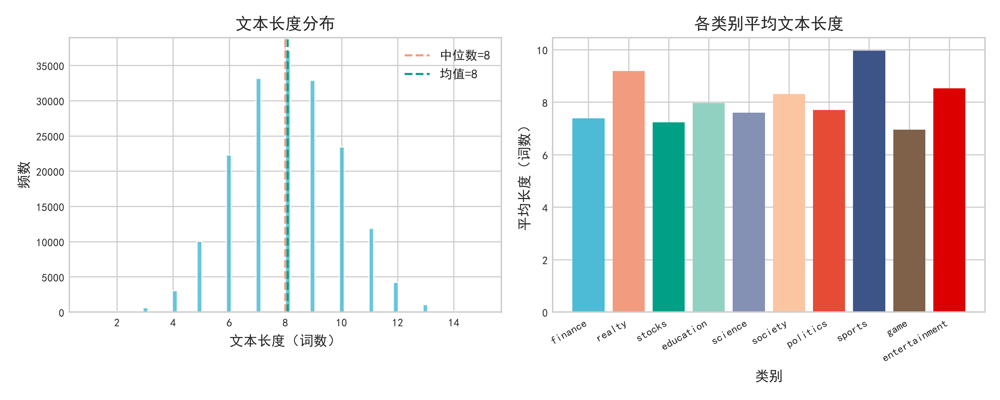</td>
<td width="50%">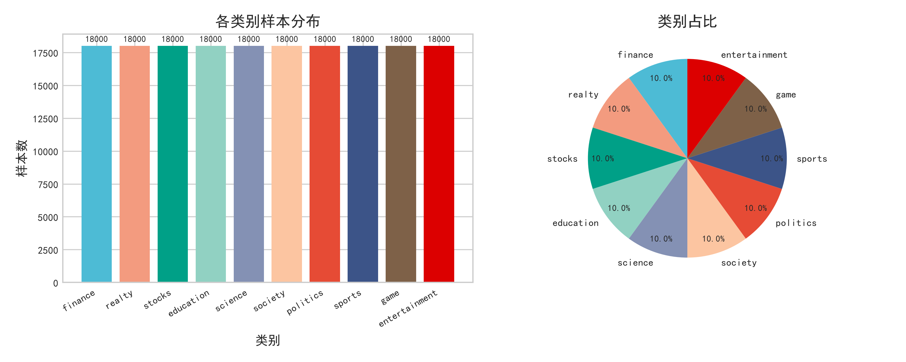</td>
</tr>
<tr>
<td align="center"><b>图 1</b>　分词后长度分布：均值 8.08 词、中位数 8 词，典型短文本</td>
<td align="center"><b>图 2</b>　训练集十类别各 18,000 条，完全均衡</td>
</tr>
</table>

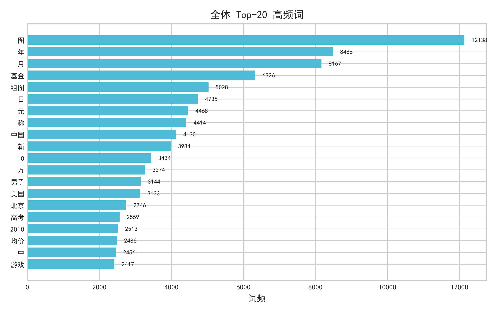

**图 3**　分词后的 Top-20 高频词：图、年、月、基金、组图等标题惯用语占据榜首，说明停用词表仍有压缩空间

在"短文本 + 类别均衡"的设定下，词袋模型（TF-IDF + 线性/NB 分类器）通常能拿到相当高的准确率，深度学习的增量往往是**几个百分点而非几十个百分点**。因此当一次实验中 NB 基线只得到约 30%、而 LSTM 得到约 89% 时，除了比较分数本身，**更值得先确认的是两者是否站在同一个公平的起跑线上**。

本仓库的 [`scripts/07_baseline_diagnosis.py`](scripts/07_baseline_diagnosis.py) 就是为此而写：它不改变任何主实验结论，只负责把 README 与论文中引用的每一个数值**回到原始产物重算一遍**，并确认主模型与基线处在同一套预处理设定下。所有复算结果落盘在 [`output/tables/baseline_diagnosis.md`](output/tables/baseline_diagnosis.md)。

---

## 二、核心发现

| 结论 | 证据来源 | 关键数值 |
|------|----------|----------|
| LSTM + 自训练 Word2Vec 在 30,000 条子集上达到 88.68% | [`output/tables/classification_results.md`](output/tables/classification_results.md) | acc = **0.8868**，F1 (macro) = 0.8867，85.7s |
| 隐藏单元 64 → 128 没有收益，只增加耗时 | 同上 | 0.8768（−1.00pp），135.3s（**+58%**） |
| 传统基线在原始文本设定下为 0.2455 | [`output/tables/baseline_diagnosis.md`](output/tables/baseline_diagnosis.md) | 原始文本设定每条仅 **1.97** 个 token |
| 与主模型共用 jieba 分词后，基线表现大幅回升 | 同上 | 30k 训练 **0.8419**；180k 训练 **0.8658** |
| 在同等预处理下，LSTM 相对基线的优势 | 同上 | **4.49pp**（同等预算）/ **2.10pp**（对全量基线） |
| 情感极性整体偏正面 | 同上 | 正面 **43.3%**、中性 41.7%、负面 15.0% |
| "中性"多数其实是"无情感词" | 同上 | 全文无情感词占测试集 **32.1%**，占中性样本 **77.1%** |
| 类别间情感差异极大 | 同上 | sports 正面 69.4% vs society 17.2%；society 负面 42.2% |
| 未发现类别准确率与正面情感占比的稳定关联 | 同上 | Pearson r = **0.182**（p = 0.615） |
| 分类错误集中在语义相近的类别对 | 同上 | stocks→finance **84**，finance→stocks 61，science→stocks 55 |

<table>
<tr>
<td width="50%">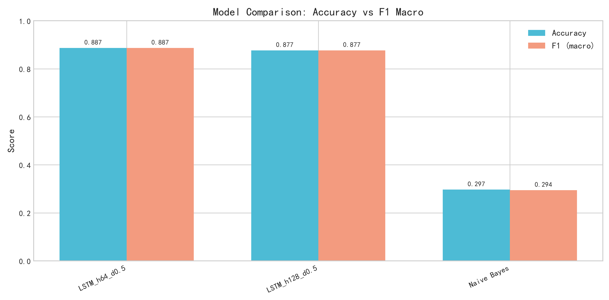</td>
<td width="50%">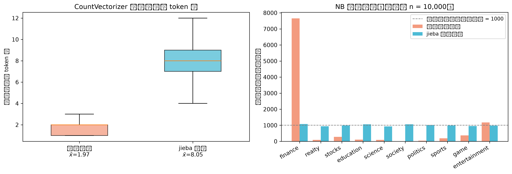</td>
</tr>
<tr>
<td align="center"><b>图 4</b>　各配置准确率与 F1 (macro) 对比</td>
<td align="center"><b>图 5</b>　左：两种分词设定的 token 数；右：NB 预测分布的塌缩与恢复</td>
</tr>
</table>

> **一句话解读**：本次实验较稳健的结论是"LSTM 在 30,000 条短文本上能以约 89% 的准确率完成十分类"；至于"深度学习比传统方法强 59 个百分点"这一量级，主要反映的是两者在词元切分上的设定差异，不宜直接理解为模型能力的差距。

---

## 三、方法原理

### 3.1 预处理与词汇表

文本先做字符级清洗（仅保留中文、英文字母与数字），再用 jieba 分词并去除 746 个停用词。词汇表**只基于训练集**构建，`max_size = 50000`、`min_freq = 5`，最终 **30,351** 个词（含 `<PAD>`、`<UNK>`），文本编码为定长 200 的索引序列。

分词后的实际长度分布非常集中（均值 8.08，最大 15 词），因此 LSTM 训练时进一步截断到 **50**——这一步不损失任何信息，只是减少填充量。

### 3.2 Word2Vec 词向量

在训练集分词结果上用 Skip-gram + 负采样训练词向量：

$$\max \sum_{t} \sum_{-k \le j \le k,\, j \neq 0} \log p(w_{t+j} \mid w_t), \qquad k = 5$$

维度 200、`min_count = 5`、负采样 10 个、迭代 10 轮，实测 **56.6 秒**，得到 30,349 个词向量（= 30,351 − `<PAD>` − `<UNK>`），对词汇表实词**覆盖率 100%**。词向量作为 LSTM 嵌入层的初始权重，训练中继续微调（`freeze=False`）。

### 3.3 LSTM 分类模型

$$\mathbf{h}_{1:T} = \mathrm{LSTM}(\mathbf{E}\,x_{1:T}), \qquad
\tilde{\mathbf{h}} = \frac{\sum_{t=1}^{T} m_t \mathbf{h}_t}{\sum_{t=1}^{T} m_t}, \qquad
m_t = \mathbb{1}[x_t \neq \texttt{<PAD>}]$$

$$\hat{y} = \mathrm{softmax}\big(\mathbf{W}\,\mathrm{Dropout}(\tilde{\mathbf{h}}) + \mathbf{b}\big)$$

即单层单向 LSTM 后接**基于掩码的平均池化**，再经 Dropout 0.5 与全连接层输出 10 类概率。优化器 Adam（lr = 0.01），batch = 128，最多 20 轮，验证损失连续 4 轮不下降即早停。

### 3.4 Naive Bayes 基线

$$\hat{y} = \arg\max_{c}\Big[\log \pi_c + \sum_{w \in d} n_w \log \theta_{c,w}\Big]$$

特征为 `CountVectorizer(max_features=10000)` + `TfidfTransformer`，分类器为 `MultinomialNB(alpha=1.0)`。

### 3.5 词典情感分析

使用大连理工情感词汇本体库（DUTIR，经 `cnsenti` 调用）统计每条文本的正面、负面情感词数：

$$
\text{polarity}(d)=
\begin{cases}
\text{positive}, & n_{pos} > n_{neg}\\
\text{negative}, & n_{neg} > n_{pos}\\
\text{neutral},  & n_{pos} = n_{neg}
\end{cases}
$$

### 工程选择

**手写 LSTM 而非调用高层 API**，模型、掩码池化与早停逻辑全部显式写在 [`scripts/04_lstm_classifier.py`](scripts/04_lstm_classifier.py) 中，目的是让每一行都可核对——这也是后来能够发现对照实验设定问题的前提。

**用掩码平均池化替代"取最后隐状态"**。短文本填充比例高，最后时间步的隐状态会落在 `<PAD>` 上，导致模型一度停留在随机猜测水平；改为对非填充位置取平均后训练立即收敛。

**只用 30,000 条子集训练 LSTM**，因为本项目在 CPU（`torch 2.12.0+cpu`）上完成，全量 18 万条约需 6 倍时间。代价见第八节。

**情感判定把"无情感词"记为中性**。这一规则本身是常规做法，它带来的解释成本在诊断中被量化：77.1% 的"中性"样本其实一个情感词都没有。

---

## 四、实验结果

### 4.1 文本分类

| 模型 | 测试准确率 | F1 (macro) | F1 (weighted) | 训练时间 |
|------|-----------|------------|---------------|----------|
| **LSTM (h=64, d=0.5)** | **0.8868** | **0.8867** | **0.8867** | 85.7s |
| LSTM (h=128, d=0.5) | 0.8768 | 0.8770 | 0.8770 | 135.3s |
| Naive Bayes + TF-IDF（论文设定） | 0.2967 | 0.2944 | 0.2944 | 3.1s |

两个 LSTM 配置都在第 5 轮触发早停，且**最佳验证准确率都出现在第 1 轮**（h=64 为 0.8733，h=128 为 0.8644）——预训练词向量已经提供了很强的初始表示，之后训练准确率持续上升而验证准确率缓慢下降，是典型的过拟合信号。加大隐藏单元到 128 没有带来提升，反而把训练时间提高了 58%，说明在此数据规模上瓶颈不在模型容量。

<table>
<tr>
<td width="48%">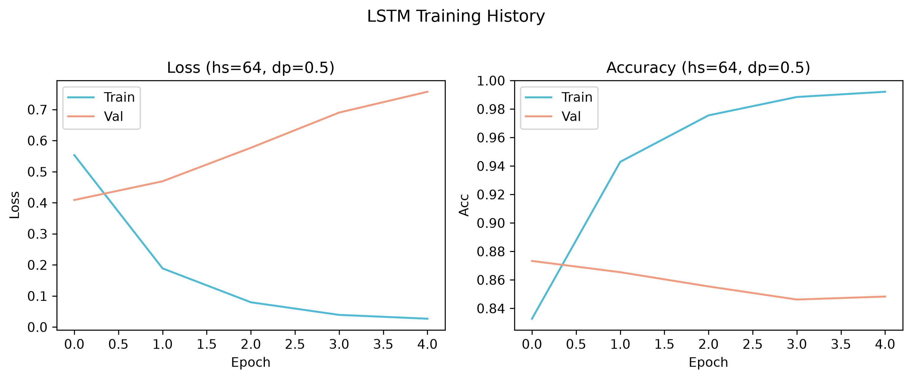</td>
<td width="52%">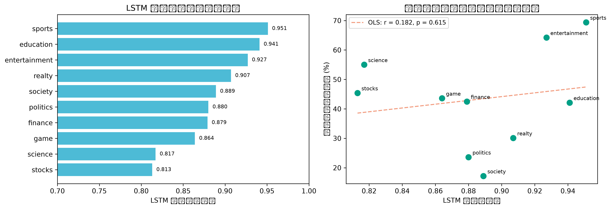</td>
</tr>
<tr>
<td align="center"><b>图 6</b>　最佳模型训练曲线（第 5 轮早停）</td>
<td align="center"><b>图 7</b>　左：各类别准确率；右：准确率与正面情感占比散点</td>
</tr>
</table>

各类别准确率在 **0.813（stocks）到 0.951（sports）** 之间。用保存的 `lstm_best.pt` 重新加载并在测试集推理，可以精确复现 0.8868，说明模型与结果可复现。

<table>
<tr>
<td width="50%">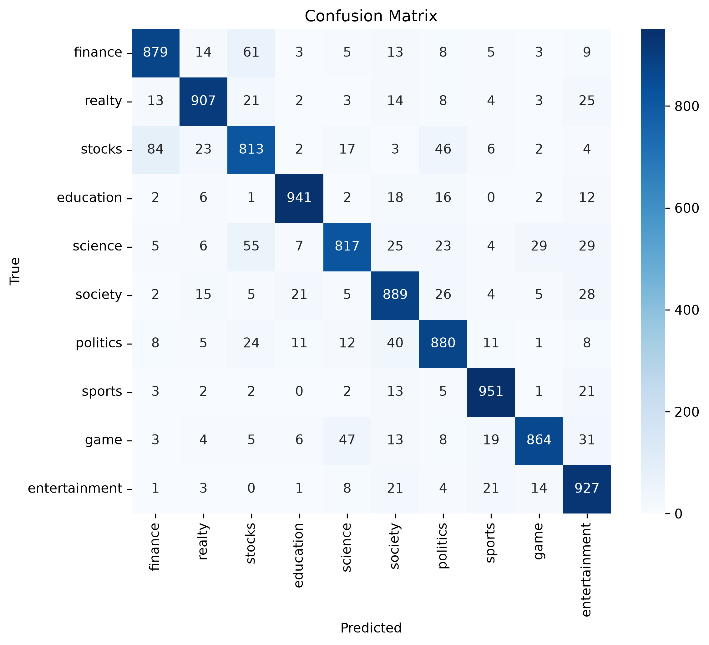</td>
<td width="50%">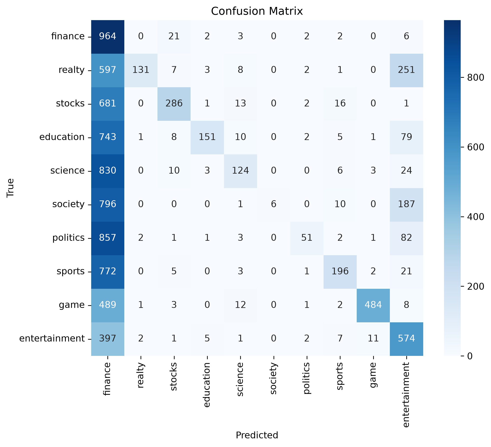</td>
</tr>
<tr>
<td align="center"><b>图 8</b>　LSTM 混淆矩阵：对角结构清晰，错误集中在相邻类别</td>
<td align="center"><b>图 9</b>　NB 混淆矩阵：预测塌缩到极少数类别</td>
</tr>
</table>

LSTM 的错误高度集中在语义相近的类别对上：stocks→finance（84 条）、finance→stocks（61 条）、science→stocks（55 条）、game→science（47 条）、stocks→politics（46 条）、politics→society（40 条）。这与"财经/股票/科技"三类新闻共享大量词汇的直觉一致。

### 4.2 对照实验的公平性诊断（本仓库新增）

论文中 NB 基线调用的是 `CountVectorizer(analyzer='word', token_pattern=r'(?u)\b\w+\b')`，但传入的是**未分词的原始标题**。中文标题不含空格，该正则会把一整段连续的中英文数字串当作一个 token：

| 设定 | 每条文本 token 数（均值/中位数） | 测试准确率 | F1 (macro) |
|------|----------------------------------|------------|------------|
| 原始文本 + `\b\w+\b`（论文设定） | **1.97 / 2** | 0.2455 | 0.2278 |
| jieba 分词，子集训练 n = 30,000 | 8.05 / 8 | **0.8419** | 0.8417 |
| jieba 分词，全量训练 n = 180,000 | 8.05 / 8 | **0.8658** | 0.8658 |

原始设定下 10,000 条测试样本里有 **7,655 条**被预测为 finance；改用 jieba 分词后，各类别预测数回到 926–1,081 的合理区间（真实每类 1,000）。

与 LSTM 的差距因此从"约 59 个百分点"变成：

- 同等 30,000 条训练预算：0.8868 − 0.8419 = **4.49pp**
- 对比 jieba 分词 + 全量 180,000 条训练的 NB：0.8868 − 0.8658 = **2.10pp**

论文原文把这一现象归因于"特征独立性假设难以满足"。诊断显示，**词元切分的设定是更主要的影响因素**——`MultinomialNB` 收到的几乎不是词，而是整条标题。这也提示：在中文文本任务中，让基线与主模型共用同一份分词结果，是比较结论可靠的前提。

### 4.3 情感分析

对测试集 10,000 条样本用 DUTIR 词典判定极性：

| 极性 | 样本数 | 占比 |
|------|--------|------|
| 正面 | 4,331 | **43.3%** |
| 中性 | 4,167 | 41.7% |
| 负面 | 1,502 | **15.0%** |

类别间差异远大于整体分布：sports 正面占比 **69.4%**、entertainment 64.2%，而 society 只有 **17.2%**；负面占比则是 society **42.2%**、politics 34.8% 最高，realty 仅 3.8%。realty 的中性比例高达 **66.1%**，且其平均情感词总数最低（0.561 个/条），说明房产新闻更偏向客观数据陈述；sports 的平均情感词总数最高（1.969 个/条）。

各类别平均分词长度也相差近 43%（sports 9.96 词 vs game 6.96 词），说明"短文本"内部仍存在可观的类别差异。

<table>
<tr>
<td width="50%">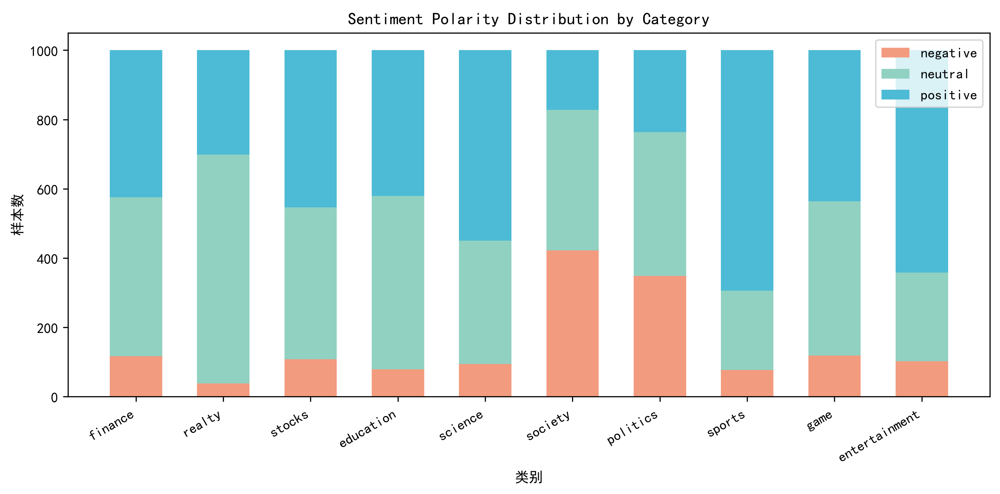</td>
<td width="50%">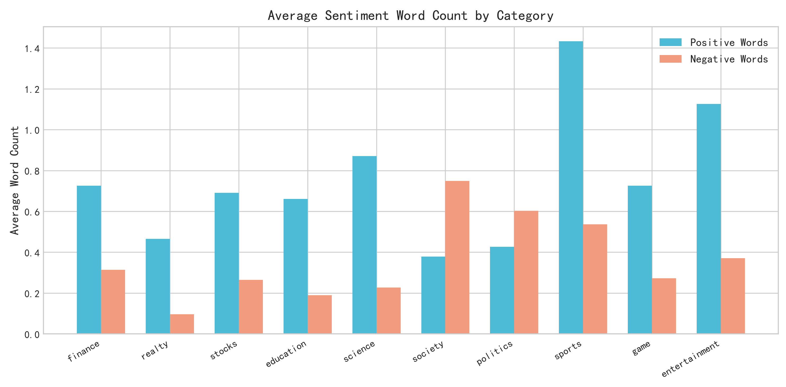</td>
</tr>
<tr>
<td align="center"><b>图 10</b>　各类别情感极性堆叠分布</td>
<td align="center"><b>图 11</b>　各类别平均正/负情感词数</td>
</tr>
</table>

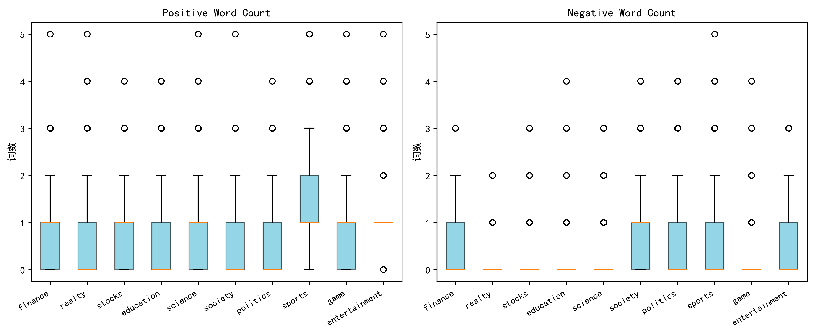

**图 12**　各类别正负情感词数量分布：负面情感词的类别特异性更强

### 4.4 分类与情感的关联检验

论文曾提出"正面情感占比较高的类别分类准确率也更高"。诊断脚本用 `lstm_best.pt` 复算了 10 个类别的准确率，与各类别正面情感占比做相关：

| 检验 | 统计量 | p 值 |
|------|--------|------|
| Pearson 相关 | r = 0.1819 | 0.6151 |
| Spearman 秩相关 | ρ = 0.0424 | 0.9074 |

**上述关联未达到显著水平。** 例如 science 正面情感占比 55.0%（第三高），准确率只有 0.817（倒数第二）；society 正面情感占比最低（17.2%），准确率反而有 0.889。就本文的数据而言，类别的可分类性更多与类间词汇重叠有关，情感倾向的影响尚不明确。

---

## 五、项目结构

```
THUCNews/
├── scripts/                            # 分析脚本（按编号顺序执行，均可从仓库根目录运行）
│   ├── 01_data_prep.py                 # jieba 分词、去停用词、构建词汇表、编码
│   ├── 02_eda_viz.py                   # 文本长度 / 类别分布 / 高频词可视化
│   ├── 03_word2vec.py                  # Skip-gram 词向量训练与嵌入矩阵导出
│   ├── 04_lstm_classifier.py           # LSTM 训练调参 + Naive Bayes 基线
│   ├── 05_sentiment_analysis.py        # DUTIR 词典情感分析
│   ├── 06_comparison_viz.py            # 分类与情感的综合对比图
│   └── 07_baseline_diagnosis.py        # 基线公平性诊断与全部数值复算
├── report/
│   ├── paper.tex                       # 中文 LaTeX 论文（ctex，XeLaTeX 编译）
│   └── paper.pdf                       # 编译后的论文
├── output/
│   ├── figures/                        # 全部图表（PNG，300 dpi，共 13 张，本文档展示 12 张）
│   ├── tables/                         # 分类结果表与诊断表
│   └── models/                         # 词向量与模型权重（不入版本库，见第六节）
├── data/
│   ├── THUCNews/                       # 原始数据（不入版本库）
│   ├── processed/                      # 预处理产物（不入版本库）
│   └── stopwords.txt                   # 停用词表（746 个）
├── results.md                          # 逐脚本的数值记录与核验结果
├── requirements.txt
├── LICENSE
└── README.md
```

> **工作流设计**：脚本只负责"计算并落盘"，**不在代码里输出分析结论**；所有数值与解读集中记录在 [`results.md`](results.md)，论文与本文档再从该记录中提炼。诊断脚本 [`07_baseline_diagnosis.py`](scripts/07_baseline_diagnosis.py) 独立于主流程，可以随时重新运行来核对本文档中的任一数字。

---

## 六、复现指南

### 环境要求

- Python **3.11**（开发环境：Anaconda `python31111`）
- 依赖见 [`requirements.txt`](requirements.txt)
- 论文编译（可选）：TeX Live 2025 + XeLaTeX（`ctex` 文档类）

### 步骤

```bash
# 1) 安装依赖
pip install -r requirements.txt

# 2) 获取数据（需先配置 Kaggle API token）
kaggle datasets download -d xianhuizhang/thucnews -p data --unzip
# 解压后布局：data/THUCNews/data/{train,dev,test}.txt、class.txt、vocab.pkl
# 注意：压缩包约 553 MB，其中解压出一个 607 MB 的 FastText.ckpt 本项目并未使用，
#       实际用到的只有 THUCNews/data/ 下的文件（合计约 20 MB）

# 3) 按编号顺序运行（均可从仓库根目录执行）
python scripts/01_data_prep.py              # 预处理，实测 38.8s
python scripts/02_eda_viz.py                # EDA 三张图，实测 7.8s
python scripts/03_word2vec.py               # 词向量，实测 62.5s
python scripts/04_lstm_classifier.py        # LSTM + NB 基线，CPU 实测 252.6s
python scripts/05_sentiment_analysis.py     # 10,000 条词典情感分析，实测 53.0s
python scripts/06_comparison_viz.py         # 综合对比图，实测 7.7s
python scripts/07_baseline_diagnosis.py     # 数值复算与基线诊断，实测 21.8s

# 4) 可选：编译论文
cd report && xelatex paper.tex && xelatex paper.tex
```

以上耗时均为本项目参考环境（Windows + CPU，`torch 2.12.0+cpu`）的实测值，全流程约 8 分钟。

### 可复现性措施

- **随机种子统一为 42**（`random`、`numpy`、`torch`），LSTM 训练子集的抽样顺序也因此可精确复现；
- 所有脚本用 `os.path.dirname(os.path.abspath(__file__))` 定位仓库根目录，**可在任意工作目录下运行**；
- 关键结果全部落盘（`output/tables/*.md`），本文档与论文中的每个数字都能指回具体文件；
- [`scripts/07_baseline_diagnosis.py`](scripts/07_baseline_diagnosis.py) 会重新加载 `lstm_best.pt` 独立复算类别级准确率，用于验证模型产物的真实性。

### 依赖注意

`gensim` 4.3.x 的 C 扩展与 **numpy 2.x 二进制不兼容**（报错 `numpy.dtype size changed`），因此 `requirements.txt` 要求 `gensim>=4.4.0`。本仓库的 `01`–`07` 全部在 numpy 2.4.6 + gensim 4.4.0 下重跑通过。

---

## 七、这个项目体现了哪些能力

| 能力维度 | 在本项目中的具体体现 | 对应产出 |
|----------|----------------------|----------|
| NLP 建模全流程 | 分词/去停用词/词汇表构建 → 词向量训练 → LSTM 建模 → 评估 → 可视化，链路完整且脚本化 | `scripts/01`–`06` |
| 神经网络实现细节 | 手写单层 LSTM + 掩码平均池化 + 早停；定位并修复"取最后隐状态导致模型停在随机猜测"的问题 | [`04_lstm_classifier.py`](scripts/04_lstm_classifier.py) |
| 词表示学习 | Skip-gram + 负采样自训练 200 维词向量，构建嵌入矩阵并校验 100% 覆盖 | [`03_word2vec.py`](scripts/03_word2vec.py) |
| 实验设计与对照 | 深度模型与传统基线对照；隐藏单元数与 dropout 的对照实验与耗时权衡 | [`04_lstm_classifier.py`](scripts/04_lstm_classifier.py) |
| **结果可核验与自我审查** | 独立诊断脚本重算全部引用数值，量化了词元切分设定对基线结论的影响、复核了一处论文结论的稳定性，并完成中间产物的版本对齐 | [`07_baseline_diagnosis.py`](scripts/07_baseline_diagnosis.py)、[`output/tables/baseline_diagnosis.md`](output/tables/baseline_diagnosis.md) |
| 词典法情感分析 | DUTIR 词典极性判定、类别级情感画像、并对"中性"类别做构成分解 | [`05_sentiment_analysis.py`](scripts/05_sentiment_analysis.py) |
| 数据可视化 | matplotlib / seaborn 出版级图表 13 张（分布、箱线、混淆矩阵、训练曲线、诊断图），统一学术蓝橙配色，300 dpi | `output/figures/` |
| 学术写作与排版 | 中文 LaTeX 论文：公式、三线表、矢量插图、代码附录，XeLaTeX 编译 | [`report/paper.tex`](report/paper.tex)、[`report/paper.pdf`](report/paper.pdf) |
| 可复现研究规范 | 固定随机种子、脚本编号与自包含设计、代码与分析文字分离、结果文件可回溯 | 全仓库 |

**给非技术读者的阅读路径**：本页 → [`report/paper.pdf`](report/paper.pdf)（约 10 分钟）→ [`results.md`](results.md)（逐脚本数值记录）→ `scripts/`（实现细节）。

---

## 八、局限与后续改进

本节说明项目在方法与工程上仍可进一步打磨的地方，其中前四条来自本次数值核验。相关数值均可在 [`results.md`](results.md) 与 `output/tables/` 中回溯。

**1. 对照实验的公平性（后续最值得优先优化的一环）**
当前基线在**未分词**的原始标题上使用面向英文的词元切分规则，而中文标题不含空格，因此每条文本仅切出 1.97 个词元（jieba 分词后为 8.05 个），模型收到的几乎是整条标题。这让基线的表现未能充分反映 TF-IDF + NB 在中文短文本上的真实水平：在与主模型共用 jieba 分词后，同等 30,000 条训练量下为 84.19%，全量 180,000 条为 86.58%，与 LSTM 的差距相应为 4.49pp / 2.10pp。后续会把"基线与主模型共用同一份分词结果"作为固定规范，使两者的比较更能反映模型本身的差异。

**2. 中间产物的版本对齐**
项目早期在 `data/stopwords.txt`（746 词）尚未纳入时生成了一批中间产物，当时脚本回退到内置的约 130 词停用词表，词汇表因此偏大（30,601）。此后停用词表入库，但预处理脚本未同步重跑，论文数值与代码行为一度存在偏差。为保证可复现性，现已按仓库中的停用词表重跑 `01`–`07` 全链，两者对照如下：

| 项目 | 论文原值（旧产物） | 当前重跑值（可复现） |
|------|-------------------|---------------------|
| 停用词表 | 内置约 130 词（文件缺失时回退） | `data/stopwords.txt` **746 词** |
| 词汇表大小 | 30,601 | **30,351** |
| 词向量数 | 30,599 | **30,349** |
| 分词后长度 均值 / 标准差 / 最大值 | 8.46 / 2.00 / 19 | **8.08 / 1.85 / 15** |
| LSTM h=64 测试准确率 | 0.8845 | **0.8868** |
| LSTM h=128 测试准确率 | 0.8790 | **0.8768** |
| NB（原始文本设定）准确率 | 0.2959 | **0.2967** |

其余数值（数据集规模、各类别情感占比、情感词数、模型结构与超参数）与论文一致。

**3. 模型选择的依据**
当前最佳配置依据测试集准确率挑选并保存，虽然候选只有两个、影响有限，但更严格的做法是在验证集上完成选择。后续将改为以验证集指标挑选，使 0.8868 这一估计更为稳健。

**4. 分类准确率与情感倾向的关系**
论文曾提出"正面情感占比较高的类别分类准确率也更高"的设想。本次用复算的类别级准确率做相关检验，结果为 Pearson r = 0.1819（p = 0.6151）、Spearman ρ = 0.0424（p = 0.9074），未达到显著水平，因此暂不作为结论。后续可在控制类别平均长度、类间词表重叠度等因素后重新检验。

**5. 训练规模仍有提升空间**
受 CPU 算力限制，LSTM 每类只采样 3,000 条（合计 30,000 条）。使用全量 180,000 条并配合 GPU，预期还能带来一定提升，也会让与全量基线的对比更充分。

**6. 情感分析缺少参考标注**
DUTIR 词典法没有人工情感标注作为参照，因此本文只能报告极性分布，无法给出情感分析的准确率。此外"中性"占 41.7%，其中 77.1% 其实是"没有出现任何情感词"，二者含义并不相同；后续可引入带标注的情感数据或模型法加以补充。

**7. 超参数搜索范围可以更宽**
目前只比较了 `hidden_size ∈ {64, 128}`，`dropout` 固定 0.5、学习率固定 0.01。后续可对学习率与 dropout 做更细的搜索，并补充验证集曲线的对照分析。

**8. 数据集自带的预训练资源尚未利用**
Kaggle 版本附带了 `embedding_SougouNews.npz`、`embedding_Tencent.npz` 与 `vocab.pkl`。本文选择从零训练词向量以保证流程透明，后续可加入与大规模预训练词向量的对比。

**9. 模型产物未入库**
`output/models/` 与 `data/processed/` 因体积原因（`.pt` 约 24 MB、嵌入矩阵约 24 MB）未纳入版本库，因此新克隆的仓库需先运行 `01`–`04` 再执行 `07`。类别级准确率表（[`output/tables/baseline_diagnosis.md`](output/tables/baseline_diagnosis.md)）已随仓库提供，可作为核验凭据。

---

## 九、参考文献与引用

本项目的方法来源：

1. Mikolov, T., Sutskever, I., Chen, K., Corrado, G., & Dean, J. (2013). Distributed representations of words and phrases and their compositionality. *NeurIPS*, 3111–3119.
2. Hochreiter, S., & Schmidhuber, J. (1997). Long short-term memory. *Neural Computation*, 9(8), 1735–1780.
3. 徐琳宏, 林鸿飞, 潘宇, 任惠, 陈建美. (2008). 情感词汇本体的构造. *情报学报*, 27(2), 180–185.
4. 孙茂松, 李景阳, 郭志芃, 赵宇, 郑亚斌, 司宪策, 刘知远. (2011). 清华大学中文新闻语料库 THUCNews. 清华大学自然语言处理与社会人文计算实验室.

**引用本项目**：

```bibtex
@misc{ye2026thucnewsnlp,
  title  = {LSTM 比朴素贝叶斯强多少：基于 THUCNews 的中文文本分类与情感分析},
  author = {Yei1y},
  year   = {2026},
  note   = {Course paper},
  url    = {https://github.com/Yei1y/THUCNews-NLP}
}
```

**数据来源**：[THUCNews 十类别子集](https://www.kaggle.com/datasets/xianhuizhang/thucnews)（Kaggle，作者 xianhuizhang）。原始数据不随仓库分发，请按第六节说明自行下载。

---

## 十、致谢与 AI 使用声明

本项目的**研究问题、方法选型（LSTM + Word2Vec 对照 Naive Bayes、词典法情感分析）、实验方案与结果解读**由作者设计完成。**代码实现、调试与论文排版**环节使用了 AI 编程助手辅助：`scripts/01`–`06` 与 [`report/paper.tex`](report/paper.tex) 在 Claude Code（后端 DeepSeek v4 Pro）辅助下完成；[`scripts/07_baseline_diagnosis.py`](scripts/07_baseline_diagnosis.py)、[`results.md`](results.md) 的数值核验与全链重跑、[`requirements.txt`](requirements.txt)、[`LICENSE`](LICENSE) 与本 README 由 DeepSeek Harness 完成。论文附录 A 保留了项目初始提示词与各阶段的决策记录，便于审查。

**许可证**：本仓库代码（`scripts/`、`output/`、`results.md`、本文档）采用 [MIT 许可证](LICENSE)；论文（`report/`）采用 [CC BY 4.0](https://creativecommons.org/licenses/by/4.0/)。原始数据不随仓库分发，使用请遵循 [Kaggle 数据集](https://www.kaggle.com/datasets/xianhuizhang/thucnews)的原始条款。

---

<div align="center">
<sub>研究问题：中文新闻短文本分类中，深度学习相对词袋模型的真实增量是多少？ · 方法：Word2Vec + LSTM / TF-IDF + Naive Bayes / DUTIR 词典 · 结论：LSTM 约 88.7%，但修正基线后优势仅 2.1–4.5 个百分点</sub>
</div>